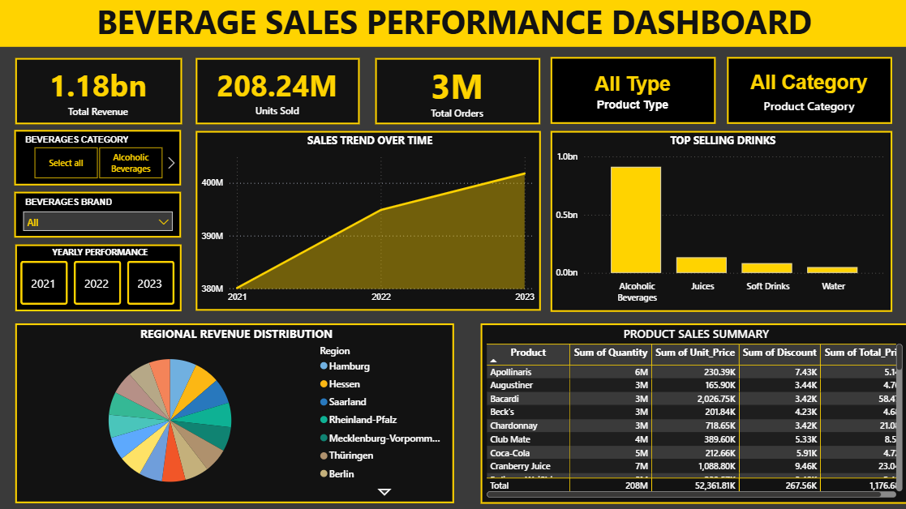

# 📊 Beverage Sales Performance Analysis Dashboard

An interactive Power BI dashboard that analyzes beverage sales performance across different product categories, brands, and regions. This project demonstrates how business intelligence tools can transform raw sales data into meaningful insights for decision-making.

---

## 📸 Dashboard Preview



---

## 🎯 Project Overview

This dashboard was developed to help business stakeholders monitor sales performance, identify high-performing products, and analyze revenue trends over time. It provides an interactive and user-friendly interface that allows users to explore data using filters and visualizations.

---

## ❓ Business Problem

Organizations generate large volumes of sales data every day, making it difficult to identify trends and monitor performance using spreadsheets alone.

This dashboard provides a centralized view of key performance indicators (KPIs), allowing decision-makers to quickly evaluate business performance and make data-driven decisions.

---

## 🎯 Project Objectives

- Analyze total sales performance.
- Monitor yearly sales trends.
- Identify the highest-performing beverage categories.
- Compare product sales performance.
- Analyze regional revenue distribution.
- Build an interactive dashboard for business users.

---

## 🛠️ Tools & Technologies

- **Power BI Desktop**
- **Power Query**
- **DAX (Data Analysis Expressions)**
- **Microsoft Excel**

---

## 📈 Key Performance Indicators (KPIs)

| KPI | Value |
|------|------:|
| Total Revenue | 1.18 Billion |
| Units Sold | 208.24 Million |
| Total Orders | 3 Million |
| Product Types | Multiple |
| Product Categories | Multiple |

---

## ✨ Dashboard Features

- Interactive slicers for Year, Brand, and Beverage Category
- KPI cards for quick performance monitoring
- Sales trend analysis
- Top-selling product visualization
- Regional revenue analysis
- Product sales summary table
- Dynamic filtering across all visuals

---

## 💡 Key Insights

- Generated over **1.18 Billion** in total revenue.
- Processed approximately **208 Million** units sold.
- Completed nearly **3 Million** customer orders.
- Alcoholic beverages generated the highest revenue among all product categories.
- Sales increased steadily from **2021 to 2023**, indicating positive business growth.

---

## 📌 Business Recommendations

- Increase inventory for top-selling beverage categories.
- Expand promotional campaigns for high-performing products.
- Review low-performing products for pricing and marketing improvements.
- Continue monitoring yearly sales trends to support forecasting and strategic planning.

---

## 📂 Repository Structure

```text
beverage-sales-performance-analysis/
│
├── dashboard/
├── data/
├── documentation/
├── images/
└── README.md
```

---

## 📚 Documentation

Additional project documentation is available below:

- [Business Questions](documentation/Business_Questions.md)
- [Data Dictionary](documentation/Data_Dictionary.md)
- [Data Cleaning](documentation/Data_Cleaning.md)
- [Business Insights](documentation/Insights.md)

---

## 📥 Download the Dataset and Power BI Dashboard

The `.csv and ``.pbix` file is hosted on Google Drive because it exceeds GitHub's upload size limit.

**Download Here:**

**CSV File**
> *https://drive.google.com/file/d/1jxdof7kSFqTzDsmOAS9tK3tip-9y4WX5/view?usp=sharing*

**PBIX File**
>*https://drive.google.com/file/d/13wiraHSCpj0kbHszK1vG1p6_NjR4ptYD/view?usp=sharing*
---

## 🚀 Skills Demonstrated

- Data Cleaning
- Data Modeling
- Power Query
- DAX
- Dashboard Design
- Data Visualization
- Business Intelligence
- KPI Reporting
- Data Storytelling

---

## 👨‍💻 Author

**Bryan Bernardino**

Computer Engineering Graduate | Aspiring Data Analyst

If you found this project interesting, feel free to connect with me or explore my other repositories.
